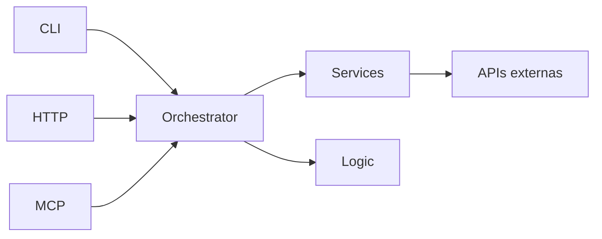

# AI Location Context Tool

[](https://github.com/hector-manny/Integrador-IA-Agents/actions/workflows/ci.yml)

Herramienta Node.js que recibe ZIP codes de EE.UU., consulta APIs públicas (zippopotam, Open-Meteo, ip-api), enriquece el contexto con lógica de dominio (WMO, outdoor score, agent context) y expone el resultado vía **CLI**, **HTTP** y **MCP STDIO**.

## Requisitos

- Node.js >= 18
- Conexión a internet (APIs externas)

## Instalación e inicio rápido

```bash
git clone <repo-url>
cd Integrador-IA-Agents
```

Instala dependencias y ejecuta el CLI con un ZIP:

```bash
npm install
node index.js 80203
```

> **Sin API keys ni `.env`.** No necesitas claves de API ni archivo de configuración: la config tiene defaults (validados con Zod) y todas las APIs externas son **públicas y gratuitas** (zippopotam.us, Open-Meteo weather, Open-Meteo air-quality y el fallback ip-api.com). Solo requieres **conexión a internet**. El `.env` es **opcional** (ver la sección **Configuración**).

## Validación rápida

```bash
node index.js 80203
```

Salida esperada: **exit code 0** y un JSON con la forma `LocationContext`:

- `input` — `{ zip, source }` (`source: "zip"` o `"ip_fallback"`).
- `location` — ciudad, estado, lat/lon y zona horaria.
- `weather` — temperatura, viento y `condition` (WMO mapeada), o `null` si la API falla.
- `air_quality` — `aqi_us`, o `null` si la API falla.
- `outdoor_score` — entero **1–10** (o `null` si faltan todos los factores).
- `agent_context` — objeto en español listo para agentes (ver [Agent Context](#agent-context)).

## Configuración

El `.env` es **opcional**: todas las variables tienen defaults (validados con Zod), por lo que la herramienta funciona sin configuración. Crea un `.env` (a partir de `.env.example`) solo si quieres sobreescribir alguna:

| Variable | Default | Descripción |
|----------|---------|-------------|
| `PORT` | `3000` | Puerto del servidor HTTP |
| `CACHE_TTL_SECONDS` | `900` | TTL de caché en memoria (15 min) |
| `HTTP_TIMEOUT_MS` | `5000` | Timeout por llamada HTTP externa |
| `IP_API_BASE_URL` | `http://ip-api.com` | Base URL del fallback IP (tier gratuito HTTP) |

## Migración v0.4.0

Breaking change en **v0.4.0**: `agent_context` pasa a un objeto estructurado con `summary`, `headline`, `tldr`, `flags`, `recommendations`, `alerts`, `followup_hints` y `meta`. Sustituye el shape PRD de 4 campos de v0.3.0 y el shape anidado del plan 008.

### Equivalencias plan 008 → v0.4.0

| Campo v0.2.x / plan 008 | Campo v0.4.0 | Notas |
|-------------------------|--------------|-------|
| `intent` | *(eliminado)* | Siempre `outdoor_activity_recommendation`; ya no se expone |
| `decision.label` | `headline` | Frase corta de decisión para el usuario |
| `decision.score` | `outdoor_score` (raíz) | El número 1–10 sigue en `LocationContext`; `headline`/`tldr` lo reflejan narrativamente |
| `decision.can_go_outside` | `flags.outdoor_friendly` | Ver regla en [Agent Context](#agent-context) |
| `decision.should_warn_user` | `alerts` | `true` si hay alertas; severidad en `alerts[].severity` |
| `reasoning.positive_factors[]` | `summary`, `tldr` | Factores favorables integrados en narrativa |
| `reasoning.negative_factors[]` | `alerts`, `recommendations.avoid_activities` | Riesgos como alertas tipadas + actividades a evitar |
| `recommendation.short` | `tldr` | Resumen de una línea |
| `recommendation.detailed` | `summary` | Párrafo completo en español |
| `bot_instructions` | `followup_hints`, `recommendations`, `response_tone` | Preguntas sugeridas + ropa/actividades; tono en `response_tone` |
| `bot_instructions.tone` | `response_tone` | `urgent` / `cautious` / `informative` / `friendly` derivado de alertas |

### Equivalencias v0.3.0 (PRD) → v0.4.0

| Campo v0.3.0 | Campo v0.4.0 |
|--------------|--------------|
| `summary` | `summary` |
| `recommendation` (string) | `recommendations` (objeto: `clothing`, `suitable_activities`, `avoid_activities`, `hydration_priority`, `best_window_today`) |
| `risk_flags` (array de strings) | `alerts` (objetos con `type`, `severity`, `message`) + `flags` (booleanos) |
| `outdoor_score_explanation` | Integrado en `summary` y `headline` |

## Migración v0.3.0

Breaking changes en **v0.3.0** (alineación con PRD y prueba técnica):

- Eliminado enriquecimiento LLM vía API, `service_warnings`, `GET /health`, flags `includeEnrichment`/`--enrichment` y código `INVALID_PARAMETER`.
- `agent_context` vuelve al shape PRD: `summary`, `recommendation`, `risk_flags`, `outdoor_score_explanation`.
- Sin límite artificial de 10 ZIPs por request batch.

## CLI

Comando canónico: `node index.js <zip> [zip2 ...]`. Alternativa equivalente vía npm: `npm run cli -- 80203`.

### Un ZIP

```bash
node index.js 80203
```

### Múltiples ZIPs

```bash
node index.js 80203 10001 94105
```

### Fallback IP

Si el ZIP no existe en zippopotam, se usa geolocalización por IP (`source: "ip_fallback"`):

```bash
node index.js 99999
```

## HTTP

Iniciar servidor:

```bash
npm run start:http
```

### Endpoints

| Método | Ruta | Descripción |
|--------|------|-------------|
| `GET` | `/context?zip=80203` | Contexto de un ZIP |
| `GET` | `/contexts?zips=80203,10001` | Múltiples ZIPs (array) |

### Ejemplos curl

```bash
curl "http://localhost:3000/context?zip=80203"
curl "http://localhost:3000/contexts?zips=80203,10001,94105"
```

Códigos HTTP:

- `200` — éxito
- `400` — `INVALID_ZIP` (formato ZIP o query requerida ausente)
- `404` — `LOCATION_NOT_FOUND` (ZIP + IP fallback fallaron)
- `500` — `INTERNAL_ERROR` (mensaje genérico; detalle solo en logs del servidor)

## MCP STDIO

Iniciar servidor MCP:

```bash
npm run start:mcp
```

### Tools registradas

| Tool | Input | Descripción |
|------|-------|-------------|
| `get_location_context` | `{ zip }` | Contexto de un ZIP |
| `get_location_contexts` | `{ zips[] }` | Múltiples ZIPs |

Configurar en Cursor u otro cliente MCP apuntando a `node src/mcp/mcp-server.js` con transporte STDIO.

## Arquitectura



- **Adapters delgados:** CLI, HTTP y MCP delegan al orchestrator; validación compartida en `src/adapters/input-validation.js`.
- **Degradación parcial:** si falla clima o AQI, el campo correspondiente es `null` y el outdoor score se calcula con los factores disponibles.
- **Caché multicapa:** claves `zip:`, `weather:`, `air:`, `context:` con TTL configurable.

## Outdoor Score (v0.4.1)

Escala entera **1–10**. Se parte de una base 5 y se suman los ajustes de cada factor disponible:

```text
score = clamp(5 + Σ ajustes, 1, 10)
```

Reglas:

- Un factor **ausente** (`null`) se **excluye** de la suma (no penaliza).
- Si faltan **todos** los factores → `outdoor_score: null`.
- Si `source === "ip_fallback"` se aplica **−1 adicional** tras el clamp (mínimo 1) por incertidumbre de ubicación.

**Temperatura (°C)**

| Rango | Ajuste |
|-------|--------|
| 18–26 | +3 |
| 10–17.99 | +2 |
| 26.01–30 | +1 |
| 30.01–32 | 0 |
| 32.01–35 | −1 |
| 0–9.99 | 0 |
| < 0 | −3 |
| > 35 | −3 |

**Viento (km/h)**

| Rango | Ajuste |
|-------|--------|
| < 12 | +2 |
| 12–17.99 | +1 |
| 18–24.99 | 0 |
| 25–34.99 | −1 |
| ≥ 35 | −2 |

**Condición** (WMO mapeada, ver [Mapeo WMO](#mapeo-wmo))

| Condición | Ajuste |
|-----------|--------|
| Clear / Mainly Clear / Partly Cloudy | +1 |
| Cloudy / Unknown | 0 |
| Foggy | −1 |
| Light Rain / Moderate Rain / Rainy / Heavy Rain / Rain Showers / Heavy Rain Showers | −2 |
| Snowy / Heavy Snow | −3 |
| Thunderstorm / Severe Thunderstorm | −4 |

**Calidad del aire (AQI US)**

| Rango | Ajuste |
|-------|--------|
| ≤ 50 | +1 |
| 51–75 | 0 |
| 76–100 | −1 |
| 101–150 | −1 |
| > 150 | −3 |

Ejemplos de discriminación (batch de regresión):

| Perfil | Score |
|--------|-------|
| NYC ideal (Clear, 22°C, AQI 42) | 10 |
| Boston ventoso (28.5 km/h) | 9 |
| Dallas nublado + AQI 57 | 6 |
| Miami tormenta + 32°C | 1 |
| IP fallback + AQI 77 | 8 (base 9 − 1) |

## Mapeo WMO

Los códigos WMO de Open-Meteo se mapean al campo de salida `condition` en `src/logic/weather-mapper.js`. El criterio agrupa los códigos por **familias** (despejado/nublado, niebla, lluvia por intensidad, nieve, chubascos y tormenta): no existe una única agrupación "correcta", pero esta es coherente y defendible para la decisión de salir al aire libre.

| Código(s) | `condition` |
|-----------|-------------|
| 0 | Clear |
| 1 | Mainly Clear |
| 2 | Partly Cloudy |
| 3 | Cloudy |
| 45, 48 | Foggy |
| 51, 53 | Light Rain |
| 55 | Moderate Rain |
| 61, 63 | Rainy |
| 65 | Heavy Rain |
| 71, 73 | Snowy |
| 75 | Heavy Snow |
| 80, 81 | Rain Showers |
| 82 | Heavy Rain Showers |
| 95, 96 | Thunderstorm |
| 99 | Severe Thunderstorm |
| cualquier otro | Unknown |

## Agent Context

Objeto determinista en español, listo para consumo por agentes IA:

```json
{
  "summary": "Estás en Denver, Colorado. Son las 3:42 PM, hace 14°C con cielo parcialmente nublado y viento moderado de 18 km/h. La calidad del aire es buena (AQI 38). Buenas condiciones para estar al aire libre — conviene llevar chaqueta o suéter ligero.",
  "headline": "Buen día para salir en Denver",
  "tldr": "14°C, parcialmente nublado, aire limpio",
  "response_tone": "friendly",
  "flags": {
    "outdoor_friendly": true,
    "needs_jacket": true,
    "needs_umbrella": false,
    "needs_sunscreen": false,
    "uv_concern": false,
    "air_quality_concern": false,
    "wind_concern": false,
    "extreme_temperature": false,
    "location_confidence": "high"
  },
  "recommendations": {
    "clothing": "Chaqueta o suéter ligero",
    "suitable_activities": ["caminar", "fotografía al aire libre", "paseo por el parque"],
    "avoid_activities": [],
    "hydration_priority": "normal",
    "best_window_today": "tarde"
  },
  "alerts": [],
  "followup_hints": {
    "user_location_known": true,
    "data_age_minutes": 0,
    "suggested_questions": ["¿Quieres el pronóstico de las próximas horas?"]
  },
  "meta": {
    "generated_at": "2026-06-18T15:42:00-06:00",
    "location_source": "zip",
    "ttl_seconds": 900
  }
}
```

### Regla `flags.outdoor_friendly`

`outdoor_friendly` es `true` solo si se cumplen **ambas** condiciones:

1. `outdoor_score >= 6` (campo raíz de `LocationContext`, no dentro de `agent_context`).
2. No hay alertas con `severity === "critical"` (p. ej. tormenta eléctrica).

**No bloquea** `outdoor_friendly`:

- Alertas `medium` o `high` que no sean `critical` (viento notable, AQI moderado).
- `flags.wind_concern` (`windspeed_kmh >= 20`) — añade alerta `wind` medium y precaución en `recommendations.avoid_activities`.
- `flags.air_quality_concern` (`aqi_us > 100`) — genera alerta y puede cambiar actividades, pero no fuerza `outdoor_friendly: false` por sí solo si el score ≥ 6 y no hay alerta crítica.

### Flags UV (`needs_sunscreen` / `uv_concern`)

Ambos usan el mismo predicado de cielo despejado (`Clear` o `Mainly Clear`):

- `needs_sunscreen`: horario diurno (aprox. 06:00–20:00 local).
- `uv_concern`: mediodía (aprox. 10:00–16:00 local).

Invariante: `uv_concern === true` implica `needs_sunscreen === true`.

### Mapeo AQI en narrativa (`tldr`)

| AQI US | Frase en `tldr` |
|--------|-----------------|
| 0–50 | aire limpio |
| 51–100 | **aire moderado** |
| 101–150 | aire poco saludable para sensibles |
| 151+ | según banda EPA (ver `formatAqiPhraseEs`) |

Ejemplos de regresión (batch live, v0.4.1):

| ZIP | Ciudad | Condición | Viento | Score | `outdoor_friendly` | Motivo |
|-----|--------|-----------|--------|-------|-------------------|--------|
| 33101 | Miami | Thunderstorm | 19.3 km/h | 1 | `false` | Score < 6 + alerta `severe_weather` crítica |
| 02108 | Boston | Mainly Clear | 28.5 km/h | 9 | `true` | Score alto; headline Excelente; `response_tone: cautious` por viento |
| 75201 | Dallas | Cloudy | 20.3 km/h | 6–8 | `true` | AQI moderado; `wind_concern`; actividades contextuales |

### Headline por score

Cuando no hay alertas de seguridad que dominen el mensaje y `flags.outdoor_friendly` es `true`:

| `outdoor_score` | `headline` |
|-----------------|------------|
| 9–10 | `Excelente día para salir en {city}` |
| 6–8 | `Buen día para salir en {city}` |

### Alerta de calor (`heat`)

Temperaturas entre **30°C y 35°C** (inclusive) generan una alerta `medium` con `type: "heat"`.
Por encima de **35°C** se mantiene la alerta `high` `extreme_temp` y `flags.extreme_temperature: true`.

### `response_tone`

Campo máquina para que el agente ajuste el tono de respuesta (equivalente a `bot_instructions.tone` del shape plan 008):

| Valor | Cuándo |
|-------|--------|
| `urgent` | Hay alerta `critical` (p. ej. tormenta eléctrica) |
| `cautious` | Hay alerta `high` o `medium` |
| `informative` | Sin alertas y `outdoor_friendly: false` |
| `friendly` | Sin alertas y `outdoor_friendly: true` |

## Seguridad y limitaciones

### Errores HTTP 500

Las respuestas 500 devuelven siempre `{ "error": true, "code": "INTERNAL_ERROR", "message": "Internal server error" }`. Los detalles de la excepción se registran solo en stderr del servidor.

### Fallback IP (ip-api.com)

El tier **gratuito** de ip-api usa **HTTP** (no HTTPS). Para producción con requisitos estrictos, configura un endpoint HTTPS de pago:

```env
IP_API_BASE_URL=https://pro.ip-api.com
```

## Caché

Caché in-process con `node-cache`. TTL default 900s. La segunda llamada al mismo ZIP dentro del TTL no golpea APIs externas.

## Tests y calidad

```bash
npm test                 # suite offline (sin LIVE_APIS)
npm run test:live        # requiere LIVE_APIS=1 y red externa
npm run test:coverage    # cobertura ≥70% en src/services + src/logic (Node 20+)
npm run lint
npm run format:check
```

CI (GitHub Actions): `lint` + `test` en Node 18 y 20; job `coverage` en Node 20.

Tests **live** (APIs reales):

```bash
# Windows PowerShell
$env:LIVE_APIS=1; npm run test:live
```

## Troubleshooting

| Problema | Solución |
|----------|----------|
| Timeout en APIs | Aumentar `HTTP_TIMEOUT_MS` o reintentar |
| ZIP inválido | Debe ser exactamente 5 dígitos numéricos |
| APIs caídas | Respuesta parcial con `weather` o `air_quality` en `null` |

## Scripts npm

| Script | Comando |
|--------|---------|
| `npm run cli` | Ejecutar CLI |
| `npm run start:http` | Servidor HTTP |
| `npm run start:mcp` | Servidor MCP STDIO |
| `npm test` | Suite offline (default CI) |
| `npm run test:live` | Tests con APIs reales (`LIVE_APIS=1`) |
| `npm run test:coverage` | Cobertura mínima 70% (logic + services) |
| `npm run lint` | ESLint (cero warnings) |
| `npm run format` | Formatear con Prettier |
